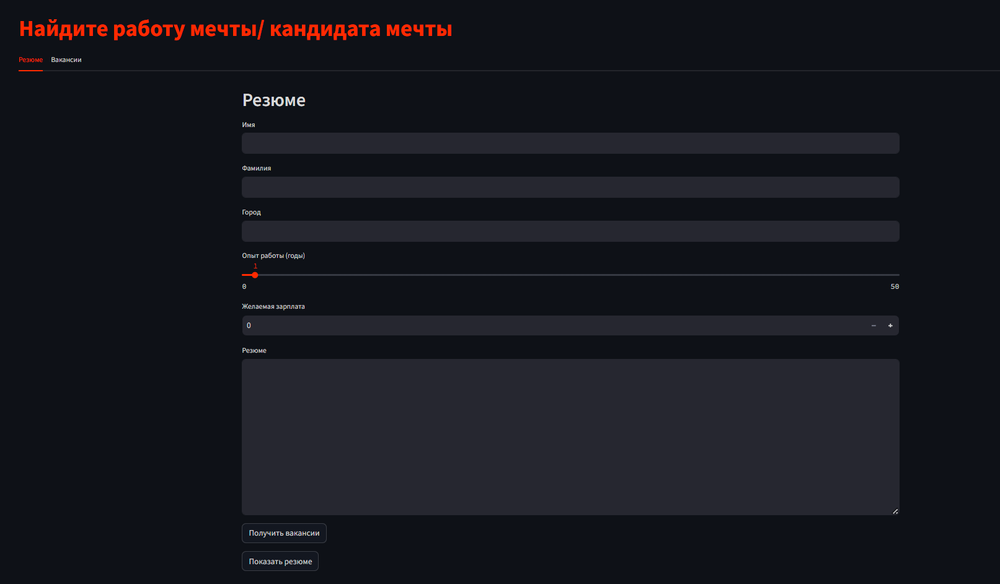

# Матчинг описания вакансий и резюме

**Цель проекта:** разработка и реализация программного решения для сопоставления текстовых описаний вакансии и резюме.

**Варианты использования сервиса на платформе:** улучшение поиска вакансий соискателями, рекомендация вакансий,
фильтрация нерелевантных кандидатов hr-специалистами, что в итоге повысит удовлетворенность всех пользователей продукта.

**Команда:**

- [Одобеску Роман](https://github.com/RomanOdobesku)
- [Масленникова Татьяна](https://github.com/Tanchik24)
- [Габидуллин Владислав](https://github.com/Vladislav-GitHub)
- [Семина Анастасия](https://github.com/sad-bkt)
- [Прозоров Вячеслав](https://github.com/wiaci)

## Содержание репозитория

- В папке [notebooks](/notebooks) содержатся jupyter ноутбуки с обучением модели, инференсом
- В папке [src/app](/app) содержатся py скрипты приложения
- В папке [src/ml](/src/ml) содержатся py скрипты для преобразования текстов в эмбеддинги и работы с векторной базой
  данных

## Начало работы

### Подготовка окружения

- Устанавливаем `python 3.10`
    - Windows

      Устанавливаем через [официальный установщик](https://www.python.org/downloads/)

    - Linux

        ```bash
        sudo apt install python3.10
        ```

- Устанавливаем [poetry](https://python-poetry.org/docs/#installation)
    - Windows

      Используйте [официальные инструкции](https://python-poetry.org/docs/#windows-powershell-install-instructions)
      или команду `powershell`

        ```powershell
        (Invoke-WebRequest -Uri https://install.python-poetry.org -UseBasicParsing).Content | py -
        ```

    - Linux

        ```bash
        curl -sSL https://install.python-poetry.org | python3 -
        ```
- Устанавливаем требуемые пакеты с помощью команды
    ```bash
    poetry install
    ```
- Скачиваем [базу данных](https://dropmefiles.com/sDVnt) в папку vector_db
## Запуск системы

- Для запуска системы введите команды
    ```bash
    streamlit run main.py
    ```
  После этого нужно перейти по адресу http://localhost:8501/

## Выбор технологий и инструментов:

### Датасет

Датасет сначала размечался с помощью GPT-4 и SBERT (Only unlabeled sentence-pairs), но качество подобранных пар был
неудовлетворительным, поэтому было решено собрать его вручную.
Использовались следующие данные:

- [Датасет резюме HeadHunter](https://drive.google.com/file/d/1ikA_Ht45fXD2w5dWZ9sGTSRl-UNeCVub/view)
- [Yandex Jobs](https://www.kaggle.com/datasets/kirili4ik/yandex-jobs/)
- Вакансии с Авито

Датасет состоит из пар резюме-вакансия, города резюме и вакансии (для фильтрации) и метки 1/0 - есть мэтч или нет.

### Инструменты

С помощью multilingual-e5-large векторизуем вакансии и резюме, полученные эмбеддинги храним в векторной базе данных
Faiss.

### Подбор резюме/вакансий

Загруженный текст резюме или вакансии преобразуется в вектор, далее происходит фильтрация по городу (если у вакансии в
поле города
указана "Удаленная работа", то кандидаты на должность не фильтруются, а в обратной задаче, если у кандидата указан
удаленный формат работы, то вакансии подбираются тоже только удаленные), после этого отбирается топ 100 ближайших по
косинусному расстоянию, и из них sbert отбирает топ 10 наиболее релевантных.

[//]: # (почему эти инструменты?)

### Демонстрационный проект

Сделан с помощью Streamlit, так как это одна из самых простых и удобных библиотек для создания веб-приложения.


## Эксперименты

Каждый эксперимент проводился для 20 объектов.

| Задача                         | mean nDCG@K | map@K |
|--------------------------------|-------------|-------|
| Подбор резюме для hr           |             |       | 
| Подбор вакансий для соискателя |             |       | 

**Precision at K (p@K)** — доля релевантных объектов среди K.
Precision at K — метрика простая для понимания и реализации, но имеет важный недостаток — она не учитывает порядок
элементов в «топе». Так, если из десяти элементов мы угадали только один, то не важно на каком месте он был: на первом,
или на последнем, — в любом случае inline_formula. При этом очевидно, что первый вариант гораздо лучше.

**Average precision at K (ap@K)** - сумма p@k по индексам k от 1 до K только для релевантных элементов, деленому на K.

Так, если из трех элементов релевантным оказался только находящийся на последнем месте, то ap@3 = 1/3 * (0 * 1/1 + 0 *
1/2 + 1 * 1/3) = 0.11, если угадали лишь тот, что был на первом месте, то 1/3 * (1 * 1/1 + 0 * 1/2 + 0 * 1/3) = 0.33, а
если угаданы были все, то 1/3 * (1 * 1/1 + 1 * 2/2 + 1 * 3/3) = 1.

**Mean average precision at K (map@K)** — одна из наиболее часто используемых метрик качества ранжирования. В p@K и ap@K
качество ранжирования оценивается для отдельно взятого объекта (пользователя, поискового запроса). На практике объектов
множество: мы имеем дело с сотнями тысяч пользователей, миллионами поисковых запросов и т.д. Идея map@K заключается в
том, чтобы посчитать ap@K для каждого объекта и усреднить.

**Cumulative Gain at K (CG@K)** — базовая метрика ранжирования, которая использует простую идею: чем релевантнее
элементы в топе, тем лучше, поэтому будем считать сумму оценок (например, 0 - объект нерелевантный, 3 - высоко
релевантный, 1 и 2 - что-то посередине).
Эта метрика обладает очевидными недостатками: она не нормализована и не учитывает позиции объектов.
Заметим, что в отличие от p@K, CG@K может использоваться и в случае небинарных значений эталонной релевантности.

**Discounted cumulative gain at K (DCG@K)** — модификация CG@K, учитывающая порядок элементов в списке путем домножения
релевантности элемента на вес равный обратному логарифму номера позиции.

Использование логарифма как функции дисконтирования можно объяснить следующими интуитивными соображениями: с точки
зрения ранжирования позиции в начале списка отличаются гораздо сильнее, чем позиции в его конце. Так, в случае
поискового движка между позициями 1 и 11 целая пропасть (лишь в нескольких случаях из ста пользователь заходит дальшей
первой страницы поисковой выдачи), а между позициями 101 и 111 особой разницы нет — до них мало кто доходит. Эти
субъективные соображения прекрасно выражаются с помощью логарифма.

DCG@K решает проблему учета позиции релевантных элементов, но лишь усугубляет проблему с отсутствием нормировки: если
CG@K варьируется в пределах [0, K] (для бинарных значений релевантности), то DCG@K уже принимает значения на не совсем
понятно отрезке. Решить эту проблему призвана следующая метрика.

**Normalized discounted cumulative gain at K (nDCG@K)** — нормализованная версия DCG@K:
> nDCG@K = DCG@K / IDCG@K,

где IDCG@K — это максимальное (I — ideal) значение DCG@K.
Таким образом, nDCG@K наследует от DCG@K учет позиции элементов в списке и, при этом принимает значения в диапазоне от 0
до 1.